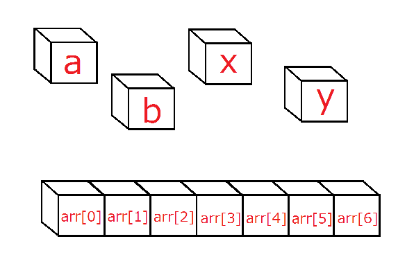
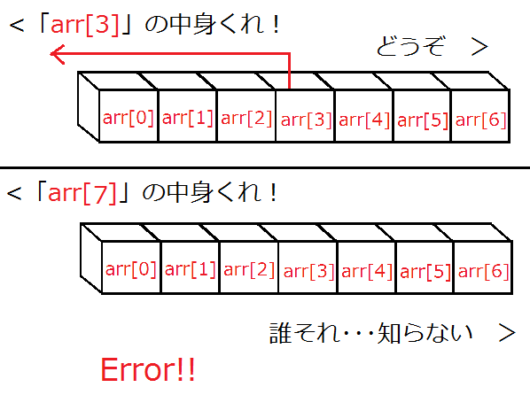

#  配列
C言語勉強会 第六回

E3  
May 29, 2013  
[引用 : Programming Place Plus](http://www.geocities.jp/ky_webid/index.html)

----
###  配列

これまで使ってきた変数は  
    *a b c i j x y z*

など、変数名のみで扱った。たとえばこいつらに0~7までの数字を代入しようとすると
    a=0; b=1; c=2; ･･･ z=7;

非常に扱いにくい。

----

ではここでおもむろに配列を使ってみる。  
＿人人人人人人人＿  
＞　配列って何　＜  
￣Y^Y^Y^Y^Y^Y￣  

配列とは *同じ型の同じ変数名で複数の記憶領域* を確保するもの。  
ようするに今までの変数が1つの箱だったとすれば、配列は棚を用意したもの。  
棚ならば、きれいにしまえる。気がする。

----

### 配列の宣言

コレまでの変数と「基本」は同じ。今までのは  
    int *a*;  
これで整数型でaという変数が宣言された。

配列の宣言は  
型　変数名[サイズ];  
といった風に宣言される。  
    int *arr[ 7 ]*;  
これでarrという配列変数がint型 *_7_* つぶんの大きさで宣言された。

----

前のスライドのaという変数は  
    *a*    
という1つだけの変数を宣言している。
先ほどのarrという配列の宣言は実質的には  
    *__arr__[ 0 ]*   *__arr__[ 1 ]*   *__arr__[ 2 ]*   *__arr__[ 3 ]*   *__arr__[ 4 ]*   *__arr__[ 5 ]*   *__arr__[ 6 ]*  
という整数型の7つの変数の宣言（のよう）になる

<small>※配列はポインタというものと仕組み的に繋がっているのでポインタをわかってないと色々とアレなのでポインタ勉強しよう。曖昧な表現の部分はポインタと絡んでて説明がめんどくさいことになってる部分。</small>

*__arr__*は配列の変数名、[　]の中の数字は _添え字_ という。  
添え字は必ず0から始まることに注意しよう！

----

### イメージ図

----

普通の変数は変数名のみで扱うが、配列は変数名と添字の組み合わせで扱う。  
配列の4番目の要素に123という整数を代入したいなら、

    arr[4] = 123;

と書く。

添字には整数の数字を指定してarr[6]のように書いても（つまり添字に定数を指定する書き方でも）いいが

変数名と括弧内の添字の組み合わせで書くということ以外は普通の変数と同じに取り扱える。  
添字に変数を指定しても構わない。

----

添字に変数を指定してもいいということは繰り返し構文とかと組み合わせるとHappyかもしれない

先の例と同じ様にarrが大きさ7で宣言されている整数の配列なら(さらに整数型の変数iが宣言されているとする)

    for( i = 0; i < 7 ; ++i )
        printf( "%d\n" , arr[i] );

などと書くと、配列の全ての要素を出力できる。

配列と繰り返し構文を使うと配列のすべての要素に同じ処理を一気にしたりできる。
----

<strong>超注意</strong>

arrが大きさ７ということは、arr[0]からarr[6]までの７つはいじっても大丈夫な部分。

しかしarr[7]やarr[-1]はいじってはならない。大きさ７ならそんなとこまで確保されてないからである。

arr[8] = 10;　とかマズイものが書かれている場合、その部分でプログラムの実行が突然止まる。

----

----

for文でも同様に添字に気を付けなければならない。先ほどのfor文

    for( i = 0; i < 7 ; ++i )
        printf( "%d\n" , arr[i] );

では、繰り返しの条件を i < 7 としているが、これは配列が大きさ７で定義されているという理由でこの条件にしている。

iは０から６まで増えていき、iが７のときには既にループから抜けているので、arr[7]を呼び出してｷﾞｬｰとかにはならない。

繰り返し構文では配列の添字がどこまで回るかに十分注意して書こう。

----

### 配列の宣言と初期化その1

配列の宣言時には括弧内に配列の大きさを指定するが、この大きさ指定部分には定数を書かなければならない。

呼び出し時には添字に変数を指定してもいいのだが、紛らわしいことに宣言時の括弧内に書くことと呼び出し時に括弧内に書くことはまったく別の意味を持つ。注意。

<small>動的確保ってやりかたもあるけどそれはまた別な話</small>

----

### 配列の宣言と初期化その2

配列は初期化もできる。

    int x = 5;  //普通の変数の初期化  
    int a[5] = {0,2,4,6,8}; //配列の変数の初期化  

上は変数xに5が入ってる。これは普通。

下は　a[0]に0、a[1]に2、a[2]に4、a[3]に6、a[4]に8  
が入っている。

配列の初期化は、順番に要素を代入していくと考えるとよい。ちなみに初期化するときは

    int a[] = {0,2,4,6,8};

これでも配列の大きさ５と勝手に解釈され、上と同じ意味になる。

----

### 多次元配列

さっきの配列は「1次元配列」とも呼ばれる。当然「2次元配列」や「3次元配列」もある。  

    int a[3];   //1次元配列  
    ↓  
    a[0] a[1] a[2]  

    int  a[3][4];   //2次元配列  
    ↓  
    a[0][0]  a[0][1]  a[0][2]  a[0][3]  
    a[1][0]  a[1][1]  a[1][2]  a[1][3]  
    a[2][0]  a[2][1]  a[2][2]  a[2][3]  

1次元配列ではサイズ数の変数を、2次元配列ではサイズ数×サイズ数、  
3次元配列では･･･と続く。2次元以上の配列を *多次元配列* という。  
行列の構造と同じなので、行列を思い浮かべると吉。  

----

### 配列の宣言と初期化その3

多次元配列の初期化はどうなるか。  

    int a[3][3] = { {2,4,6},  
                    {3,6,9},  
                    {4,8,12} };  
これは  
変数a[0][0]に2 変数a[0][1]に4 変数a[0][2]に6  
変数a[1][0]に3 変数a[1][1]に6 変数a[1][2]に9  
変数a[2][0]に4 変数a[2][1]に8 変数a[2][2]に12  
が入ってる。ちなみに上の初期化は  

    int a[3][3] = { {2,4,6},　{3,6,9},　{4,8,12} };  
    
このような1行でも表せる。  

----

１次元配列では繰り返し文ですべての要素に対して操作できたりしたが、多次元配列でも繰り返し文で同様のことができる

場合にもよると思うが、素直に考えるなら、２次元配列なら２重の繰り返し文、３次元配列なら３重の繰り返し文を使うことになるだろうたぶん

----

### 配列を利用した文字列その1

char型は文字が1文字しか入らなかった。  

    char moji = 'a';  
    
moji変数に「a」という文字を入れた。
では文章を変数に入れるにはどうすればよいのか。  
    
    char str[20] = {"hairetsu wakaran"};

こうやって宣言すると文字単体ではなく、 *文字列* が扱える。  

----

### 配列を利用した文字列その2

記述例

    #include <stdio.h> 
    int main(void){
        char str[20] = {"hairetsu wakaran"};
        printf("%s\n",str);
    }

printfでchar型1文字を出力するときは「*%c*」だったが、  
複数の文字だと「*%s*」となることに注意しよう。

----

### 配列を利用した文字列~入力編~
さっきのページではプログラム内で文字を置いていた。今度はキーボードからの入力について。  

    char a[20];  
    scanf(“%s”, a);  

こうすれば文章が入力できるようになる。この場合だと20の箱の中に1文字ずつ入れていくイメージをするとよい。  

ただし、文字列では最後に終わりを示すNULL文字というものが自動的に入るので配列に入れられる文字は（配列の個数-１）文字であることに注意して扱う。